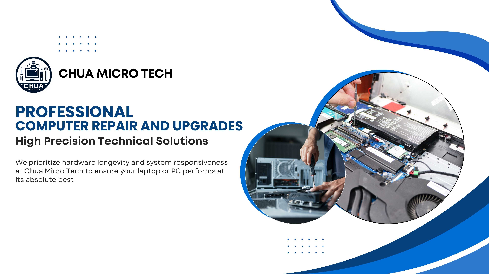

# <i>Chua Micro Tech Official Professional Website</i>

 

<i>A precision-engineered platform showcasing high-performance computing solutions and drone hardware expertise.</i>

---

## 🛠️ <i>Languages & Tools Used</i>

- 
- 
- 
- 
- 

---

## 🎯 <i>About This Website</i>

*This website serves as the professional digital hub for Chua Micro Tech, focusing on:*
- <i>A comprehensive display of specialized hardware repair services</i>
- <i>Showcasing expert DJI drone maintenance and gimbal calibration</i>
- <i>Highlighting high-end custom liquid-cooled PC workstations</i>
- <i>Connecting local clients with advanced component-level micro-soldering expertise</i>

---

## 🌟 <i>Features</i>

- *Snappy "Pop" Staggered Animations for services and contact details*
- *Technical Skew-Reveal transitions for high-performance hardware panels*
- *Fully Responsive design for seamless browsing across mobile and desktop devices*
- *Integrated Verified Client Logs via interactive Google Review UI*

---

## 📚 <i>Recent Updates</i>

- <i>🔭 Completed transition to high-performance GSAP ScrollTrigger architecture</i>  

---

## 💻 <i>How To Access The Website</i>

- *Visit the hosted professional hub [here](https://darkemperium.github.io/chuamicrotech)*
- *Navigate through the Core Capabilities to explore specialized repair solutions*

---

## 👤 <i>About Us</i>

<i>Based in Kulim, Kedah, Chua Micro Tech is a specialist center dedicated to precision engineering. We bridge the gap between standard maintenance and advanced component-level hardware repair for drones and computers.</i>

---

## 🔧 <i>Future Enhancements</i>

- *Implement a **Live Project Gallery** for custom PC build transformations*
- *Integrate an **Online Service Booking** system for repair appointments*
- *Optimize asset preloading to ensure ultra-fast load times for mobile users*

---

<i>© 2026 Coded with Visual Studio Code - Website owned by Chua Micro Tech. System Architecture by Dark Emperium. All rights reserved.</i>
